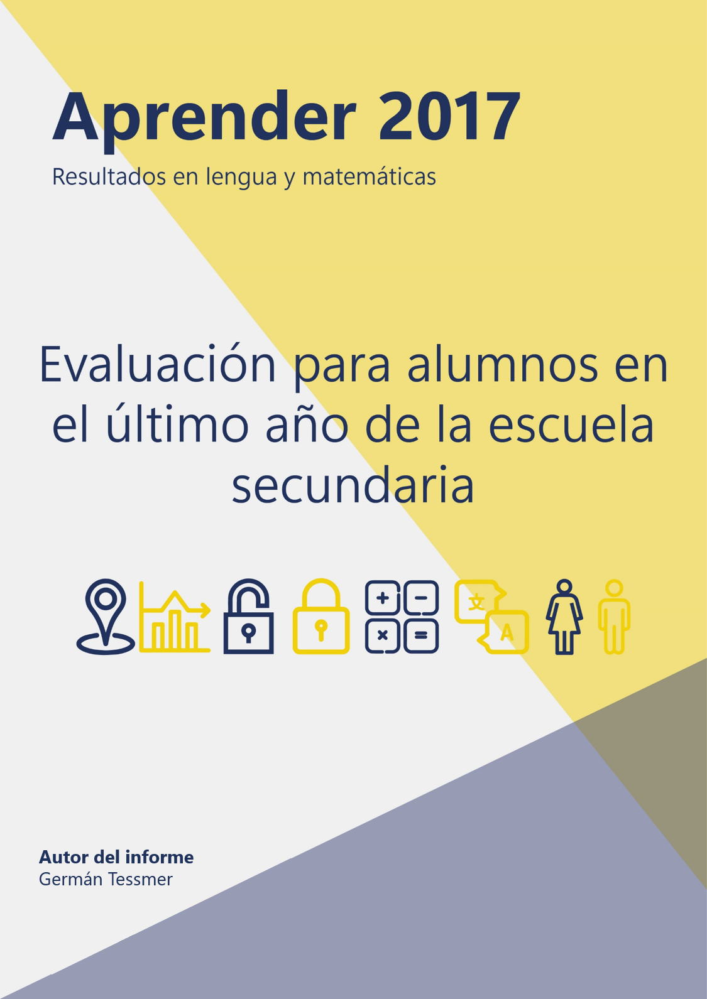
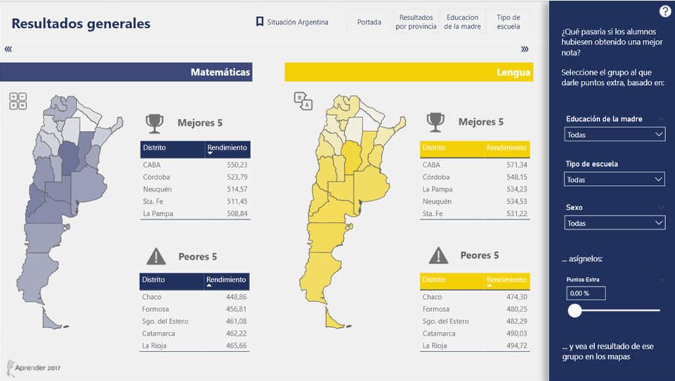
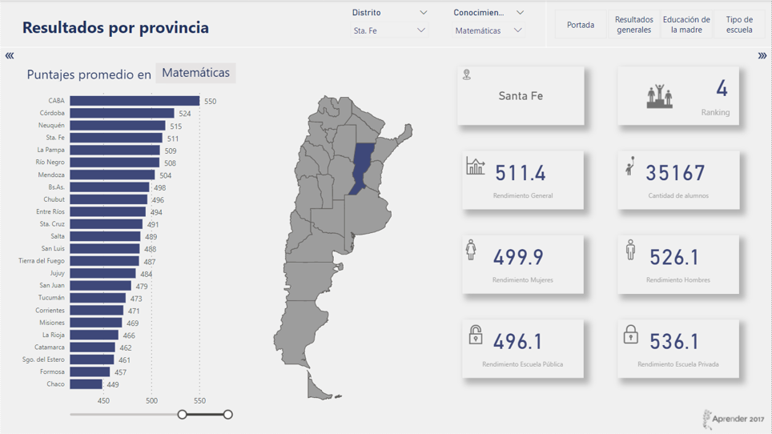
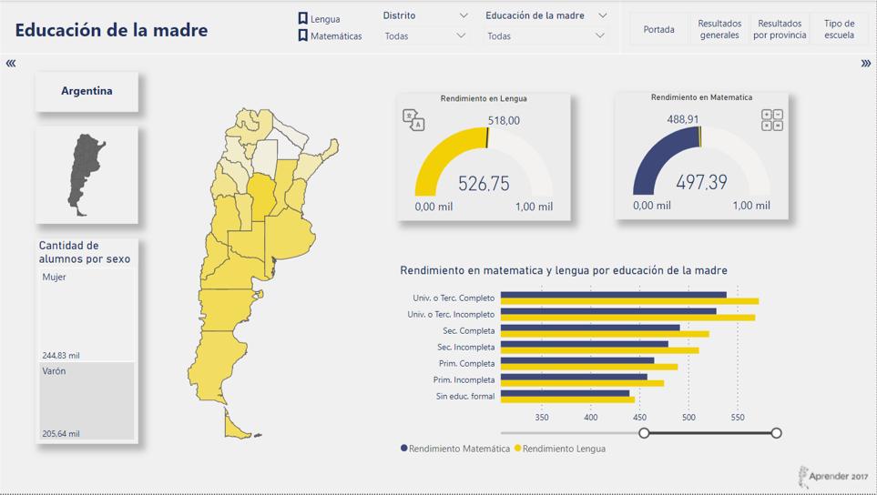
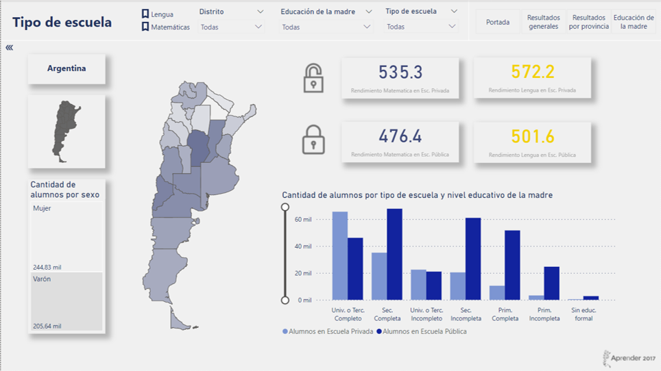

# Aprender 2017 — Dashboard de rendimiento educativo en Argentina

> Análisis y visualización interactiva (**Power BI**) de los resultados de la evaluación nacional **Aprender 2017** para estudiantes del último año del nivel secundario, en **Lengua y Matemática**. Modelado de datos en **R** (modelo relacional) y medidas en **DAX**.
>
> *Interactive Power BI dashboard analyzing Argentina's national "Aprender 2017" secondary-education assessment (Math & Language), with a relational data model built in R and DAX measures.*

Proyecto final de la **Carrera de Data Science (CoderHouse)** — Germán A. Tessmer.



---

## De qué se trata

**Aprender** es el dispositivo nacional que evalúa los aprendizajes de estudiantes de primaria y secundaria en Argentina (debut en 2016, sucesor de los ONE). Además de medir desempeño en Lengua y Matemática, releva condiciones socioeconómicas de los alumnos y de los establecimientos.

Este proyecto toma la base **poblacional, de corte transversal**, de los estudiantes del **último año del secundario** evaluados en **2017**, y construye un tablero que permite explorar las brechas de rendimiento por distrito y por características socioeconómicas.

- **Fuente:** Secretaría de Evaluación Educativa — Ministerio de Educación. [datos.gob.ar/dataset/educacion-aprender-2017](https://datos.gob.ar/dataset/educacion-aprender-2017)

## Pregunta, objetivo e hipótesis

- **Objetivo.** Analizar las diferencias de rendimiento educativo (Lengua y Matemática) a nivel **regional (provincias)** y por **tipo de gestión del establecimiento** (estatal / privado), para egresados del secundario en 2017.
- **Hipótesis.** Una parte significativa de las diferencias de rendimiento se correlaciona con características socioeconómicas de la familia (p. ej. el **nivel educativo de la madre** y la posibilidad de elegir gestión privada) y con factores estructurales de cada distrito.

## Pipeline / metodología

1. **Preparación de datos en R** (`doc R/coder_aprender.R`): etiquetado de la base cruda, creación de claves (`id_alumno`, `id_hogar`, `id_escuela`, `id_jurisdiccion`, `id_pais`), selección y renombrado de variables, y **partición en un modelo relacional** (tablas *alumno, hogar, escuela, jurisdicción, país*) según un Diagrama Entidad-Relación.
2. **Modelado en Power BI:** importación de las tablas, tratamiento de errores, **columnas calculadas** (`educacion_madre2`, `rdo_lengua`, `rdo_mates`) y **medidas DAX** (rendimiento general, cruzado por sexo y por tipo de gestión, conteos y medidas parametrizadas), más un **shape map** de provincias.
3. **Tablero de 4 páginas** con segmentadores y un mapa interactivo.

## El tablero

**Resultados generales** — panorama nacional y comparación entre distritos.


**Resultados por provincia** — perfil de cada distrito (incluye mapa de formas).


**Educación de la madre** — rendimiento según el máximo nivel educativo materno.


**Tipo de escuela** — brechas según gestión estatal o privada.


## Hallazgos principales

- **El piso es bajo en todo el país:** tomando 600 puntos (≈ 6/10) como umbral de contenidos mínimos, **ningún distrito lo supera** ni en Lengua ni en Matemática.
- **Brecha territorial moderada:** entre el distrito más rezagado (Chaco) y el de mejor desempeño (CABA) la diferencia es de **101,4 puntos en Matemática (+22,6 %)** y **97,0 puntos en Lengua (+20,5 %)**.
- **Educación de la madre:** existe una **correlación positiva** entre el nivel educativo materno y el rendimiento de los alumnos en ambas áreas.
- **Tipo de gestión:** al incorporar la gestión del establecimiento (estatal/privado), **las brechas se profundizan** —sobre todo *dentro* de cada distrito—, lo que **respalda la hipótesis** del trabajo.

## Stack técnico

`R` (tidyverse, readr, stringr) · `Power BI` (Power Query, DAX, shape map) · modelo de datos relacional.

## Estructura del repositorio

```
├─ Aprender 2017 - Tessmer.pbix     Tablero final (Power BI)
├─ Aprender 2017 - Tessmer.pdf      Documentación de diseño completa (metodología, DER, DAX, decisiones)
├─ Aprender 2017 - Tessmer.xlsx     Base etiquetada (fuente del tablero)
├─ doc R/coder_aprender.R           Preparación de datos y armado del modelo relacional
├─ doc aprender/                    Diccionarios de variables, ponderación, gráfica
├─ doc proyecto/                    Mockups, mapa de provincias (GeoJSON), assets, rúbrica
├─ img/                             Capturas del tablero (para este README)
└─ versiones/                       Iteraciones previas (no versionadas)
```

## Cómo abrir / reproducir

1. **Tablero:** abrir `Aprender 2017 - Tessmer.pbix` con **Power BI Desktop**.
   > ⚠️ Las fuentes de datos del `.pbix` apuntan a rutas locales del equipo original. Para que abra en otra máquina hay que **reapuntar el origen** (Power Query → *Configuración de origen de datos*) a `Aprender 2017 - Tessmer.xlsx` de este repo.
2. **Preparación de datos:** el armado del modelo relacional a partir del microdato crudo de Aprender 2017 está en `doc R/coder_aprender.R`.
3. **Detalle metodológico completo:** ver `Aprender 2017 - Tessmer.pdf` (incluye DER, diccionarios, columnas/medidas DAX y decisiones de diseño).

## Créditos y fuente

Proyecto final de la Carrera de Data Science (CoderHouse, 2022), por **Germán A. Tessmer**. Datos: dispositivo **Aprender 2017**, Secretaría de Evaluación Educativa, Ministerio de Educación de la Nación (Argentina). Análisis descriptivo, sin pretensión causal.
